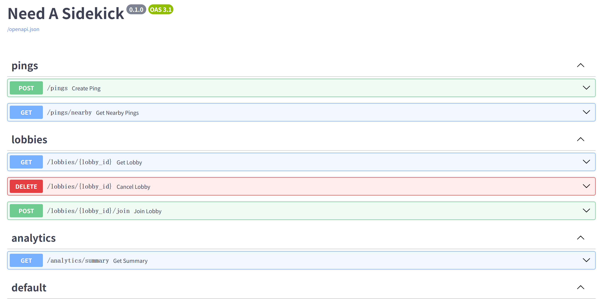

# Need A Sidekick — Terraform Deployment Guide

This project uses Terraform to provision the AWS infrastructure for **Need A Sidekick**. The stack includes networking, security groups, an Application Load Balancer, an Auto Scaling Group for backend EC2 instances, and supporting AWS services referenced by the Terraform configuration.

## Prerequisites

Before deploying, make sure you have:

- An AWS account or AWS lab environment
- Terraform installed
- AWS CLI installed
- A valid AWS credential set with permission to create the resources in this project
- A GitHub repository accessible from the EC2 instances if the startup script clones application code.

## 1. Configure AWS credentials

Terraform uses AWS credentials through the AWS provider. You must configure valid credentials before running terraform plan or terraform apply.

Using aws configure, run:

```
aws configure
```

Then enter:

```
AWS Access Key ID
AWS Secret Access Key
Default region: ap-southeast-1
Default output format: json
```

Verify credentials

Run:

```
aws sts get-caller-identity
```

If this succeeds, your credentials are valid. If it fails with InvalidClientTokenId, refresh your credentials and try again.

## 2. Deploy Infrastructure

Go inside the `/terraform` directory. Run all Terraform commands:

```
terraform init
terraform fmt -recursive
terraform validate
terraform plan
terraform apply
```

Type `yes` when prompted.

## 3. Wait for Initialization

After deployment:

```
EC2 instances install Docker
Clone repo
Build and run backend container
```

⏳ This may take a few minutes.

> Notes:
> Building the Docker image directly on EC2 ensures that the instance uses the latest code from the target branch. However, this approach is uncommon in practice because it slows down instance startup and makes deployments less consistent. Production systems usually build images in advance and store them in a registry such as Amazon ECR, allowing EC2 instances to pull a fixed image version instead.

## 4. Access the Web Application

Get the Load Balancer URL

```
terraform output
```

Look for the ALB DNS name.

If no output exists:

1. Open AWS Management Console
1. Go to EC2 → Load Balancers
1. Copy the ALB DNS name


Open in browser

```
http://<alb-dns-name>
http://<alb-dns-name>/health
http://<alb-dns-name>/docs
```

## 5. Check if it Works

Page loads → ✅ Deployment successful



## 6. Cleanup (Important)

To avoid charges:

```
terraform destroy
```

> Notes
> - `terraform validate` only checks syntax, not AWS correctness
> - `terraform plan` verifies real deployment
> - Services like ALB, NAT Gateway, and Redis may incur cost